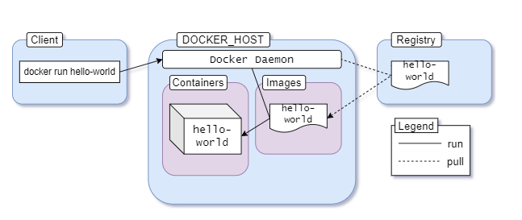

# docker-handbook

## Commands

- `docker <object> <command> <options>`. *Object* can be container, image, network, volume. *Command* is the task (example run). *Options* override the default behavior.
- `docker run <image name>`. (Short for docker container run <image name>)`
- `docker container stop <docker-container-identifier>`.
- `docker container ls --all`.
- `docker container rm <container identifier>` (remove dangling containers).
- `docker images`: get list of images.
- `docker ps -a`: get the containers that are currently running or have run in the past.
- `docker exec -it <mycontainerid> bash`: get a bash in the container.
- (on Linux)`uname -a`: get info about the kernel
- `docker container run --rm -it ubuntu` (interactive mode: -i interactive, -t formatting..) (--rm clears the container after stopping it)

## Introduction

- `Container` : A container is an abstraction at the application layer that packages code and dependencies together. Instead of virtualizing the entire physical machine, containers virtualize the host operating system only.

- `Docker image`: Images are multi-layered self-contained files that act as the template for creating containers. They are like a frozen, read-only copy of a container. Images can be exchanged through registries. An image built with Docker can be used with another runtime like Podman without any additional hassle. **Containers are just images in running state.**

- `Docker Registry`: An image registry is a centralized place where you can upload your images and can also download images created by others. Docker Hub is the default public registry for Docker. You can share any number of public images on Docker Hub for free. People around the world will be able to download them and use them freely. Apart from Docker Hub or Quay, you can also create your own image registry for hosting private images.

### Docker as a Software

- **Docker Daemon**: The daemon (dockerd) is a process that keeps running in the background and waits for commands from the client. The daemon is capable of managing various Docker objects.

- **Docker client**: The client  (docker) is a command-line interface program mostly responsible for transporting commands issued by users.

- **REST API**: The REST API acts as a bridge between the daemon and the client. Any command issued using the client passes through the API to finally reach the daemon.

According to the documentation:

> "Docker uses a client-server architecture. The Docker client talks to the Docker daemon, which does the heavy lifting of building, running, and distributing your Docker containers".

<div style="text-align:center"></div>

1. You execute docker run hello-world command where hello-world is the name of an image.
2. Docker client reaches out to the daemon, tells it to get the hello-world image and run a container from that.
3. Docker daemon looks for the image within your local repository and realizes that it's not there, resulting in the Unable to find image 'hello-world:latest' locally that's printed on your terminal.
4. The daemon then reaches out to the default public registry which is Docker Hub and pulls in the latest copy of the hello-world image, indicated by the latest: Pulling from library/hello-world line in your terminal.
5. Docker daemon then creates a new container from the freshly pulled image.
6. Finally Docker daemon runs the container created using the hello-world image outputting the wall of text on your terminal.

## Container Manipulation Basics

### How to Publish a Port

Containers are isolated environments. Your host system doesn't know anything about what's going on inside a container. Hence, applications running inside a container remain inaccessible from the outside. To allow access from outside of a container, you must publish the appropriate port inside the container to a port on your local network. The common syntax for the --publish or -p option is as follows: `docker container run --publish 8080:80 <image name>`.

**When you wrote --publish 8080:80 in the previous sub-section, it meant any request sent to port 8080 of your host system will be forwarded to port 80 inside the container‌.**

### How to Use Detached Mode

By default, containers run in the foreground and attach themselves to the terminal like any other normal program invoked from the terminal.
In order to override this behavior and keep a container running in background, you can include the --detach option with the run command as follows: `docker container run --detach --publish 8080:80 fhsinchy/hello-dock`.

**One thing that you have to keep in mind in case of the run command is that the image name must come last. If you put anything after the image name then that'll be passed as an argument to the container entry-point**

### Naming a container

Use the `name` option to name the container as you wish

`docker container run --detach --publish 8888:80 --name hello-dock-container fhsinchy/hello-dock`.

### Create a container without running

The container run command is in reality a combination of two separate commands. These commands are as follows:

- `container create` command creates a container from a given image.
- `container start` command starts a container that has been already created.

For example: `docker container create --publish 8080:80 fhsinchy/hello-dock` and then `docker container start hello-dock`

### How to Remove Dangling Containers

Containers that have been stopped or killed remain in the system. These dangling containers can take up space or can conflict with newer containers. Use : `docker container rm <container identifier>`; or you can use `docker container prune` to clear all dangling containers.

### How to Run a Container in Interactive Mode
  
Popular distributions such as Ubuntu, Fedora, and Debian all have official Docker images available in the hub. Programming languages such as python, php, go or run-times like node and deno all have their official images.

These images do not just run some pre-configured program. These are instead configured to run a shell by default. In case of the operating system images it can be something like sh or bash and in case of the programming languages or run-times, it is usually their default language shell.
  
Use te --it flag to run the container in interactive mode: `docker container run --rm -it ubuntu`
  
### Run a command inside a container (from the outside)
  
- `docker container run <image name> <command>`

### Executable Images
  
These images are designed to behave like executable programs. Example: **rmbyext** project: remove files in dir by extension script. 
You can either install python and the script or run it from a container: The fhsinchy/rmbyext image behaves in a similar manner. This image contains a copy of the rmbyext script and is configured to run the script on a directory /zone inside the container.
  
Now the problem is that containers are isolated from your local system, so the rmbyext program running inside the container doesn't have any access to your local file system. So, if somehow you can map the local directory containing the pdf files to the /zone directory inside the container, the files should be accessible to the container. One way to grant a container direct access to your local file system is by using `bind mounts`:
  
- `docker container run --rm -v ${pwd}:/zone fhsinchy/rmbyext pdf`. Binds your current directory to the /zone directory in the container (where the script is,then you pass the container-image id AND the name of the script)
  
The -v $(pwd):/zone part in the command, is used for creating a bind mount for a container. The structure of the command is: `--volume <local file system directory absolute path>:<container file system directory absolute path>`
  
## Docker Image Manipulation Basics

```docker
FROM ubuntu:latest

EXPOSE 80

RUN apt-get update && \
    apt-get install nginx -y && \
    apt-get clean && rm -rf /var/lib/apt/lists/*

CMD ["nginx", "-g", "daemon off;"]
```
- Every valid Dockerfile starts with a FROM instruction. This instruction sets the base image for your resultant image.
- The RUN instruction in a Dockerfile executes a command inside the container shell
- Finally the CMD instruction sets the default command for your image. 

RUN is an image build step, the state of the container after a RUN command will be committed to the container image. A Dockerfile can have many RUN steps that layer on top of one another to build the image. CMD is the command the container executes by default when you launch the built image.

To build the image from the Dockerfile: `docker image build .`

### Custom tag Docker images

Just like containers, you can assign custom identifiers to your images instead of relying on the randomly generated ID.

- `--tag <image repository>:<image tag>`

The repository is usually known as the image name and the tag indicates a certain build or version.

### How to Understand the Many Layers of a Docker Image

To visualize the many layers of an image, you can use the `docker image history <id>` command.

When you start a container using an image, you get a new writable layer on top of the other layers.

Docker can avoid data duplication and can use previously created layers as a cache for later builds. This results in compact, efficient images that can be used everywhere.

### How to Optimize Docker Images
